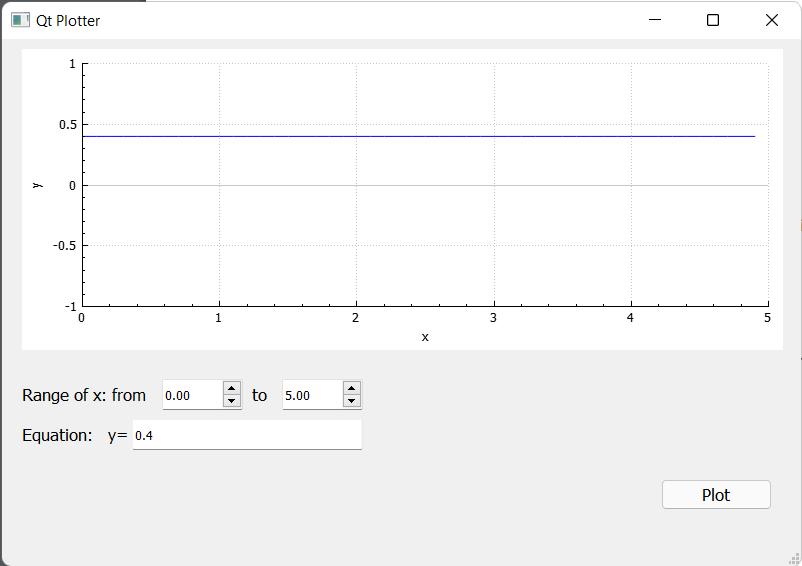
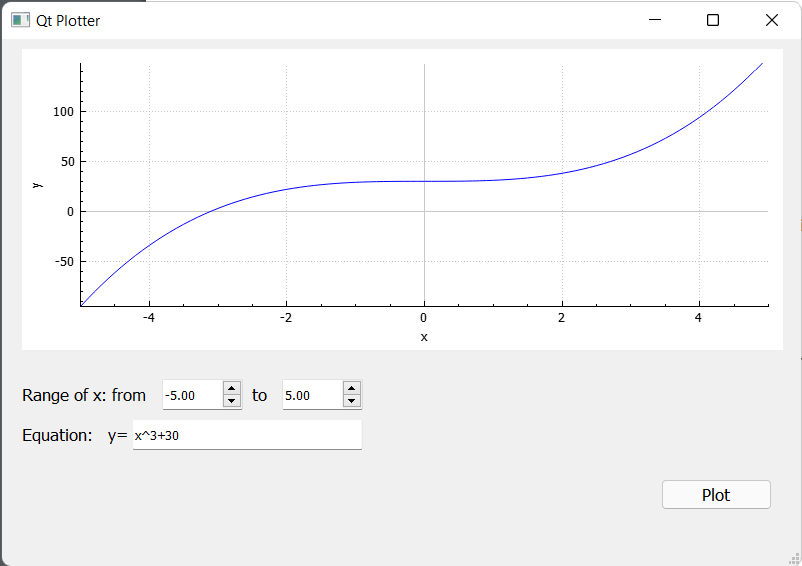
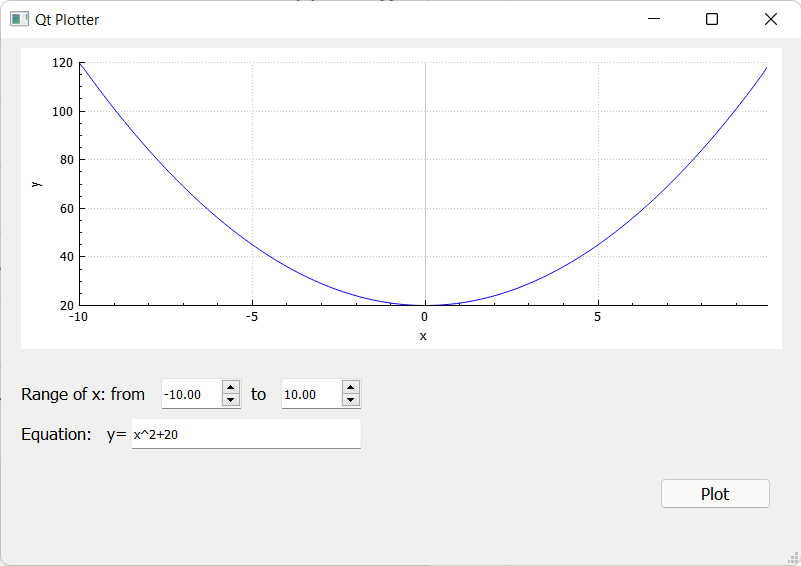
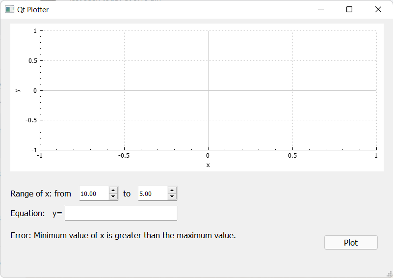
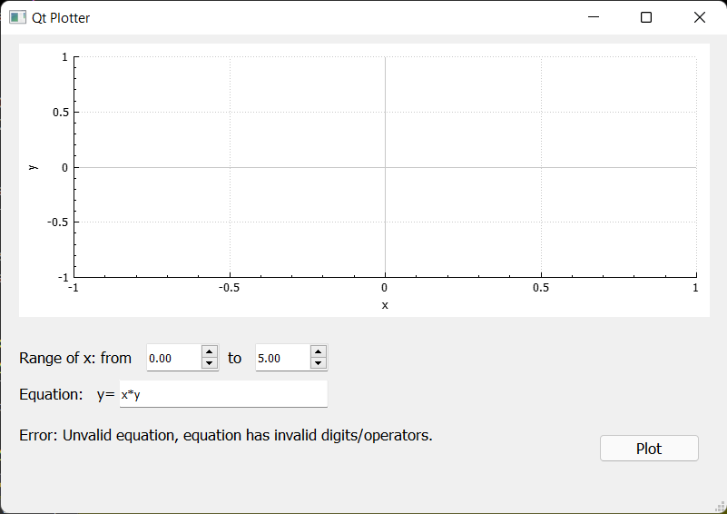

# MasterMicro task 1
# Function Plotter using Qt and C++

## External Libraries used:
1. QCustomPlot, used to display plots, Link: https://www.qcustomplot.com/
2. TinyExpr, used to evaluate the mathematical expression string at every step of x (i.e. at x=0, x=0.1, etc..), Link: https://github.com/codeplea/tinyexpr

## Screenshots of Valid/Invalid examples:
### Valid Examples

### Invalid Examples

