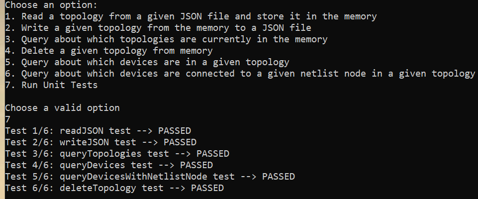
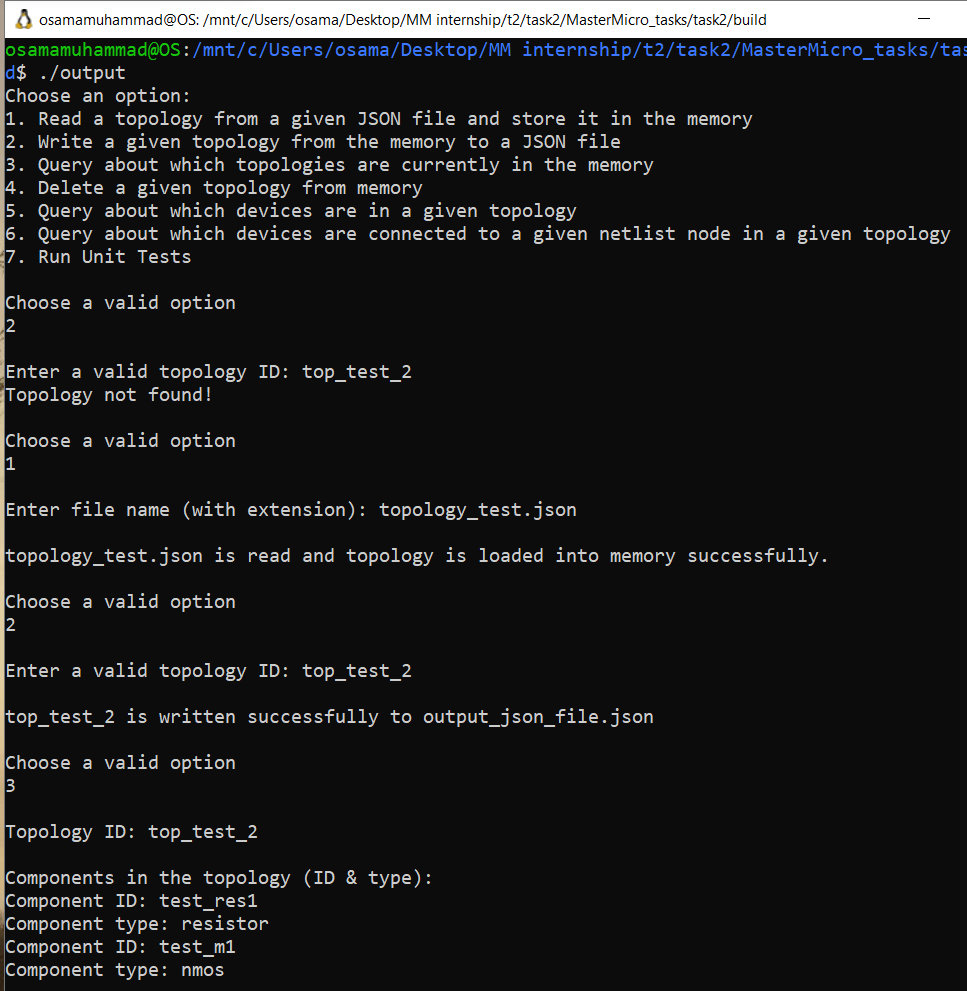
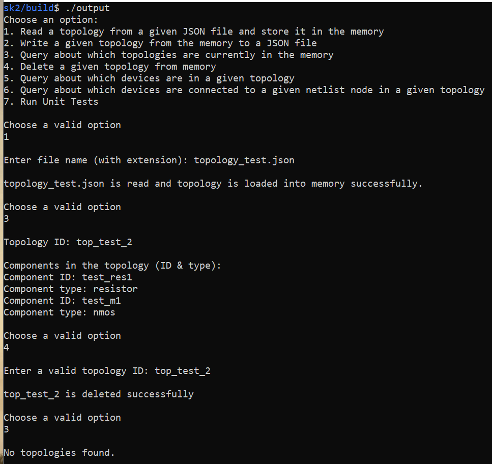
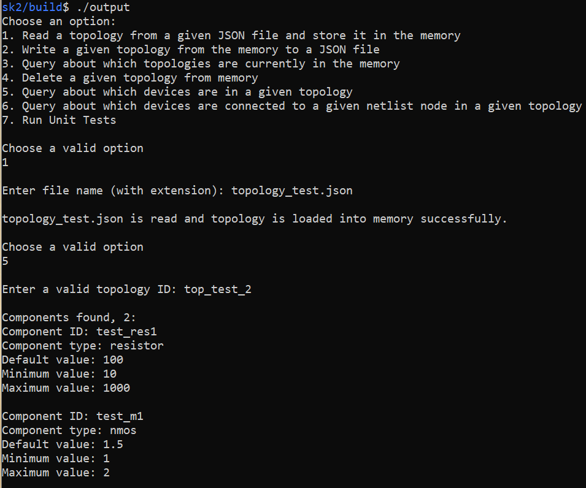
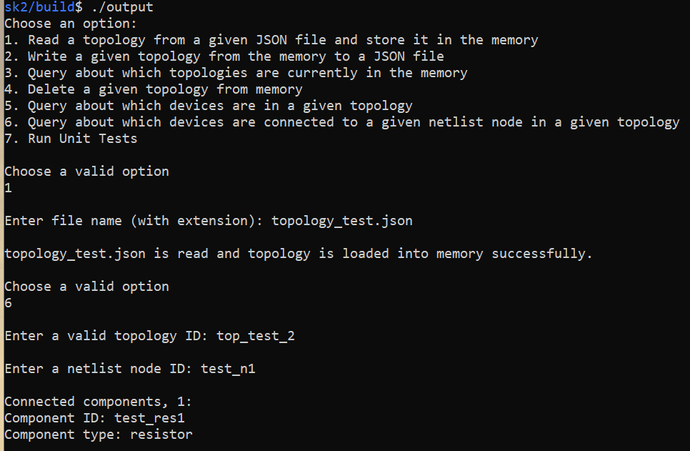

# MasterMicro task 2
# Topology API

## External Libraries used
- nlohmann/json (JSON for modern C++), used to make read/write operations easier, link: https://github.com/nlohmann/json

## Tools used:
- Docs generation: Doxygen
- Build tool: CMake
- Version control: Git

## Why did I use C++
- C++ is way faster than other popular languages (like Java/ Python).
- Supports OOP.
- Supports pointers, for better use of memory/resources.

## Screenshots
### Running unit tests

### Running code from CLI and trying some APIs

